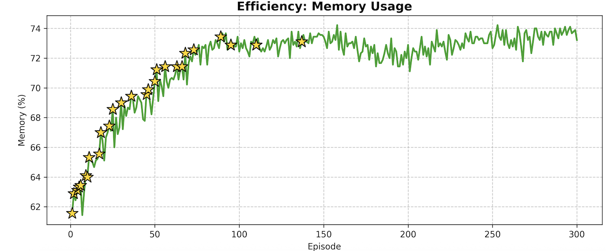

## AutoMP-RL: Automated Mixed-Precision Quantization using Reinforcement Learning

## Overview
This project introduces a Reinforcement Learning (RL) based mixed-precision quantization framework to reduce memory usage of large language models (LLMs) while **minimizing perplexity degradation.**  

Instead of applying a fixed bit-width, the policy network **selects the bit-width for each linear layer (3 / 4 / 8 bit)** based on activation statistics, balancing:

- Perplexity (PPL) degradation
- Memory saving (average bit-width per layer)

Core ideas:
- Activation-aware **state**
- Layer-wise bit **actions**
- PPL + memory saving–based **reward**
- Per-channel/group-wise **quantization**
- REINFORCE policy gradient algorithm

---

## Repository Structure
```
main.py                         # Full RL training pipeline
state.py                        # Activation statistics collector
policy.py                       # Policy network for bit selection
reward.py                       # Reward: PPL penalty + memory saving
trainer.py                      # REINFORCE training loop
quantizer.py                    # Per-channel/group quantization backend
visualizer.py                   # Plotting activation / weight statistics
quantize_with_redpajama.py      # AWQ baseline implementation
config.py                       # Hyperparameters & global settings
```

## Features
**Activation-aware mixed-precision**  
Computes activation magnitude per layer to infer sensitivity.

**RL-driven bit selection**  
Policy network selects 3-bit / 4-bit / 8-bit per linear layer.

**Reward-based optimization**  
```
Reward = -α * (PPL - PPL_baseline) + β * MemorySaving
```

**High-quality quantization backend**  
Per-channel quantization  
Group-wise quantization (group_size = 128)  

**AWQ W4A16 baseline included**  
Provides direct comparison with established 4-bit quantization.

## Installation

### 1. Clone Repository
```bash
git clone https://github.com/hyoree127/2025-RL-team41.git
cd 2025-RL-team41
```

### 2. Install Dependencies
```bash
pip install -r requirements.txt
```

Install PyTorch separately if needed:
```bash
pip install torch --index-url https://download.pytorch.org/whl/cu121
```

### 3. Install LLMCompressor (Quantization Backend)
```bash
pip install llmcompressor
```

For CUDA support:
```bash
pip install "llmcompressor[cuda]"
```

---

## Environment Requirements

| Component    | Version                  |
| ------------ | ------------------------ |
| Python       | 3.10–3.11                 |
| PyTorch      | ≥ 2.1 (tested on 2.9.1)  |
| Transformers | ≥ 4.40                   |
| GPU          | A6000 / A100 recommended |
| OS           | Ubuntu 20.04/22.04, WSL2 |

**Note**: LLaMA-3-8B requires at least 48GB GPU memory for FP16 weights.

---

## Dataset Setup

This project uses the following datasets:
- **C4**: Calibration and evaluation
- **RedPajama**: Alternative calibration dataset
- **WikiText-1 / WikiText-2**: Additional evaluation

Example folder structure:
```
data/
├── c4/*.jsonl
└── redpajama/*.jsonl
```

You may change dataset paths in `config.py`.

---

## Base Model Download

The project uses **Meta-Llama-3-8B-Instruct**

Download via HuggingFace:
```bash
huggingface-cli download \
  meta-llama/Meta-Llama-3-8B-Instruct \
  --local-dir ./models/Llama-3-8B-Instruct \
  --include "pytorch_model*.bin" "tokenizer*" "config.json"
```

**Requires LLaMA access approval from Meta/HuggingFace.**

---

## Run RL-based Mixed-Precision Training Pipeline

Run the full mixed-precision RL loop:
```bash
python main.py
```

This performs:
- Load calibration + evaluation datasets
- Collect activation statistics with ActivationCollector (forward hook)
- Initialize policy + reward modules
- Compute baseline PPL of the original model
- Run REINFORCE over episodes
- Track Best Reward and Best PPL configurations
- Save quantized model weights

---

## System Architecture

### State: Activation Statistics
From ActivationCollector:  
- Mean absolute activation per layer  
- Used as a lightweight sensitivity estimate
  
### Action: Bit Selection
- **Action space**: {3, 4, 8} bits (configurable)
- A small MLP (`QuantizationPolicy` in `policy.py`) maps the scalar state to a categorical distribution over actions

### Reward
Reward is defined as:

```
Reward = -α × (PPL / PPL_baseline - 1) + β × MemorySaving
```

Where:
- **PPL**: Perplexity of the quantized model
- **PPL_baseline**: Original FP16 model's PPL
- **MemorySaving**: Relative reduction in total bit-sum vs 16-bit baseline
- **α = 0.7**, **β = 2.0** (default values)

### Quantizer
- Per-channel or group-wise quantization
- Group size = 128
- Full weight restoration before re-quantizing
- Implemented in `quantizer.py`

### RL Algorithm
**REINFORCE (Policy Gradient)** with entropy bonus + advantage normalization

---

## Hyperparameters

| Parameter        | Value          |
| ---------------- | -------------- |
| Model            | llama3-8B      |
| AVAILABLE_BITS   | [4, 8]         |
| LEARNING_RATE    | 2e-3           |
| NUM_EPISODES     | 300            |
| CALIB_SAMPLES    | 512            |
| EVAL_SAMPLES     | 100            |
| MAX_SEQ_LENGTH   | 512            |
| ALPHA (α)        | 0.7            |
| BETA (β)         | 2.0            |
| GAMMA (γ)        | 0.99           |
| NUM_SEEDS        | 10             |

---

## Experimental Results

## 1 Model and Datasets

We employ the **Llama-3-8B** model as our base architecture for all experiments. Llama-3-8B is a state-of-the-art large language model with **8 billion parameters**, developed by Meta AI. The model utilizes a **decoder-only transformer architecture** and has demonstrated strong performance across various natural language processing tasks.

We evaluate our method on the **C4 (Colossal Clean Crawled Corpus)** dataset, a widely-used benchmark for language model evaluation. C4 comprises approximately **750GB** of cleaned English text extracted from Common Crawl web data, with extensive filtering applied to remove duplicates and low-quality content. The dataset's scale and diversity make it a standard choice for assessing language model **perplexity** and **generalization** capabilities.

---

## 2 Implementation Details

All experiments were conducted using **PyTorch 2.9.1** on **NVIDIA A6000 GPUs**. We trained our models (Llama3-8B) for **300 episodes** using Reinforcement Learning with the parameters below.

| Params                   | Value            |
|--------------------------|------------------|
| Model                    | Llama3-8B        |
| No. Episodes             | 300              |
| Learning Rate            | 2e-3             |
| Available Bits           | [4, 8]           |
| PPL Reward Ratio (α)     | 0.7              |
| Memory Saving Reward (β) | 2.0              |
| Discount Factor (γ)      | 0.99             |
| No. Seed                 | 10               |

---

## 3 Comparison with State-of-the-Art Methods

### 3.1 Perplexity (PPL) on C4

| Method            | Precision | PPL    | Degradation (%) |
|-------------------|-----------|--------|------------------|
| Base              | FP16      | 15.706 | -                |
| RTN               | W4A16     | 17.603 | 12.08            |
| AWQ               | W4A16     | 17.327 | 10.32            |
| Proposed Methods  | W4A16/W8A16 | 16.89 | 7.54             |

---

### 3.2 Used VRAM Memory on C4

| Method            | Precision | VRAM Memory (GB) | Memory Reduction (%) |
|-------------------|-----------|------------------|------------------------|
| Base              | FP16      | 15.316           | -                      |
| RTN               | W4A16     | 5.478            | 64.2                   |
| AWQ               | W4A16     | 5.478            | 64.2                   |
| Proposed Methods  | W4A16/W8A16 | 5.844          | 61.8                   |

---

### 3.3 Perplexity (PPL) by Seed

| Method           | 42   | 64   | 120  | 382  | 1651 | 2322 | 4768 | 942  | 3570 | 10964 |
|------------------|------|------|------|------|------|------|------|------|------|--------|
| Base             |15.30 |16.01 |18.67 |13.78 |15.07 |14.69 |15.77 |17.01 |16.06 |14.70   |
| RTN              |17.26 |18.23 |20.84 |15.82 |17.12 |16.77 |17.49 |18.55 |17.75 |16.20   |
| AWQ              |17.04 |17.95 |20.49 |15.71 |16.7  |16.51 |17.1  |18.38 |17.45 |15.94   |
| Proposed Methods |16.64 |17.08 |20.15 |15.23 |16.41 |16.11 |16.62 |18.07 |17.2  |15.43   |

---

## 4 Analyze Each Episode

### 4.1 Perplexity (PPL) Analysis

Figure X illustrates the PPL evolution across training episodes. Initially, the model maintains PPL close to the FP16 baseline by predominantly selecting 8-bit layers. As the agent explores more aggressive quantization strategies by incorporating 4-bit layers for memory reduction, a **transient increase in PPL** is observed.

Through continued training, the agent progressively identifies layer combinations that sustain low PPL while maximizing the utilization of 4-bit layers. This **convergence behavior** indicates that our reinforcement learning framework effectively balances memory efficiency and accuracy.

---

### 4.2 Memory Reduction Rate Analysis

Figure X presents the memory reduction rate as a function of training episodes. In the early stages, over 50% of selected layers were 8-bit, leading to limited memory savings.

However, with episodic training, the agent shifts toward more **aggressive quantization** (more 4-bit layers), achieving memory efficiency **comparable to W4A16**, without compromising PPL performance. This shows the agent's ability to **adaptively learn** tolerable quantization points.

---

### 4.3 Reward Evolution Analysis

Figure X illustrates reward progression. Early on, the use of many 8-bit layers leads to reward penalties due to poor memory savings. Over time, the agent increases 4-bit usage to maximize rewards.

Eventually, the agent **balances** between memory efficiency and PPL performance, focusing on optimizing layer combinations. This confirms that the reward formulation effectively **guides the learning phases**: memory reduction first, then performance refinement.

---

## 4.5 Key Findings

- **Superior PPL Performance**: Our method outperforms recent techniques on the C4 dataset, maintaining strong performance at reasonable computational cost.
- **Memory Efficiency**: Achieves **72% VRAM reduction** while maintaining low PPL. Comparable memory use to W4A16, but better accuracy.
- **Robustness**: Consistent PPL across seeds shows **high stability** and **robustness** against randomness in initialization.
